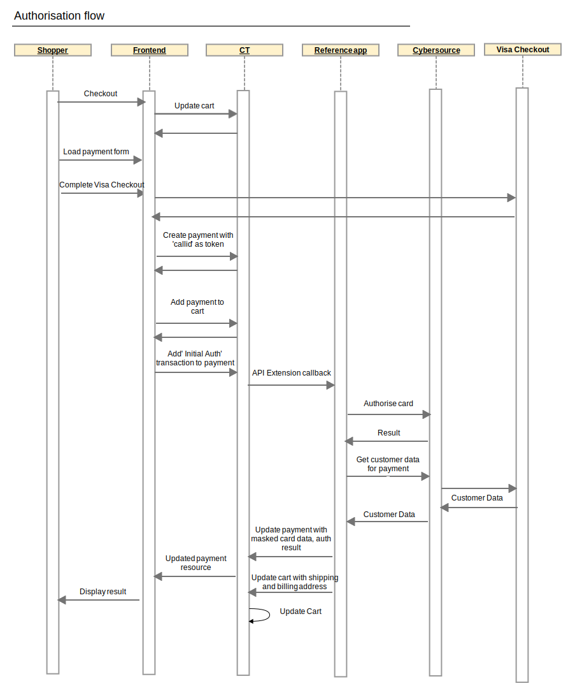

# Authorize a Payment (Visa Checkout)

## Visa Checkout Authorisation Sequence Diagram

## Process

⚠️ **3D Secure
Visa Checkout implementation does not currently support 3DS. See 'Using 3D Secure with Visa Checkout' section of the 'Visa Checkout - Using the Simple Order API' if you are looking to implement this.**

⚠️ **Shipping Address
The shipping address should be acquired from Visa Checkout. This can be set via the `init` javascript:**

	V.init({
	  apikey: "...",
	  paymentRequest: {
	    currencyCode: "GBP",
	    subtotal: "..."
	  },
	  settings: {
	    shipping: {
	      collectShipping: "true",
	      acceptedRegions: ["GB"]
	    }
	  }
	});

**If this method of collecting the shipping address is not used, a shipping address should be set on the cart before authorizing payment.**  

1.  Create / prepare your cart
    
	a.  Ensure your cart locale is set.

2.  Create a commercetools payment
    (<https://docs.commercetools.com/http-api-projects-payments>) and
    populate the following
    
	|Property|Value|Required|Notes|
	|--- |--- |--- |--- |
	|customer|Reference to commercetools customer|See notes|Required for non-guest checkout. If using MyPayments API this will automatically be set to the logged in customer. One of customer or anonymousId must be populated|
	|anonymousId|Id for tracking guest checkout|See notes|Required for guest checkout. If using MyPayments API this will automatically be set. One of customer or anonymousId must be populated|
	|paymentMethodInfo.paymentInterface|cybersource|Yes|Required for guest checkout. If using MyPayments API this will automatically be set to the session id of the anonymous oauth token. One of customer or anonymousId must be populated|
	|paymentMethodInfo.method|visaCheckout|Yes|The reference application is set up to support payments with and without payer authentication and the method is used to determine which is being used  Typically an implementation would choose one or the other and the method name may be different to this|
	|amountPlanned|Amount to authorise|Yes|Should match cart gross total, unless split payments are being used|
	|custom.fields.cs_token|Visa Checkout callid|Yes|Obtain from the 'callid' field on a successful Visa Checkout response|    

3.  Add the payment to the cart

4.  Add a transaction to the payment with the following values populated
    
    
	| Property | Value               | Notes                                 |
	| -------- | ------------------- | ------------------------------------- |
	| type     | Authorization       |                                       |
	| state    | Initial             |                                       |
	| amount   | Amount to authorise | Should match amountPlanned on payment |

    

5.  Verify the payment state
    
    a.  If the authorisation was successful the transaction state will have been updated to **Success**
    
    b.  See [Overview\#Errorhandling](Overview.md#Errorhandling) for handling errors or failures

6.  Convey the payment result to the customer. If this is the only/final payment for this order you can transition your commercetools cart to an order at this point
