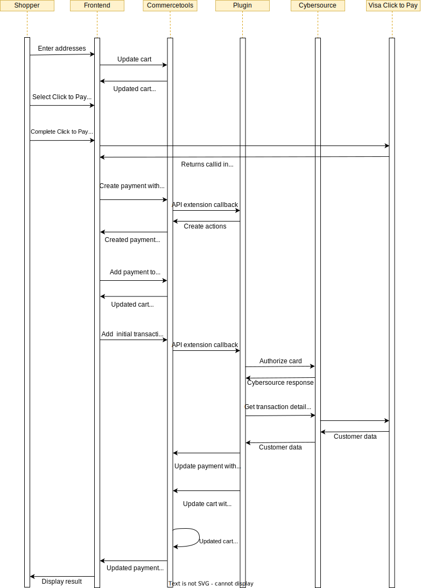

# Authorize a Payment (Visa Click to Pay)

## Visa Click to Pay Authorization Sequence Diagram

## Process

⚠️ **Shipping Address** :
The shipping address should be acquired from Visa Click to Pay. This can be set via the `init` javascript:

    V.init({
      apikey: "...",
      paymentRequest: {
        currencyCode: "GBP",
        subtotal: "..."
      },
      settings: {
        shipping: {
          collectShipping: "true",
          acceptedRegions: ["GB"]
        }
      }
    });

**If this method of collecting the shipping address is not used, a shipping address should be set on the cart before authorizing payment.**

1.  Create / prepare your cart

    a. Ensure your cart locale is set

2.  Create a Commercetools payment
    (https://docs.commercetools.com/http-api-projects-payments) and
    populate the following

    | Property                              | Value                               | Required  | Notes                                                                                                                                                                                                                                                                                                                                  |
    | ------------------------------------- | ----------------------------------- | --------- | -------------------------------------------------------------------------------------------------------------------------------------------------------------------------------------------------------------------------------------------------------------------------------------------------------------------------------------- |
    | customer                              | Reference to Commercetools customer | See notes | Required for non-guest checkout. If using MyPayments API this will automatically be set to the logged in customer. One of customer or anonymousId must be populated                                                                                                                                                                    |
    | anonymousId                           | Id for tracking guest checkout      | See notes | Required for guest checkout. If using MyPayments API this will automatically be set. One of customer or anonymousId must be populated                                                                                                                                                                                                  |
    | paymentMethodInfo.paymentInterface    | cybersource                         | Yes       |                                                                                                                                                    |
    | paymentMethodInfo.method              | visaCheckout                        | Yes       |                                                                                    |
    | amountPlanned                         | Amount to authorize                 | Yes       | Should match cart gross total, unless split payments are being used                                                                                                                                                                                                                                                                    |
    | custom.fields.isv_token               | Visa Click to Pay call id           | Yes       | Obtain from the 'callid' field on a successful Visa Click to Pay response                                                                                                                                                                                                                                                              |
    | custom.fields.isv_deviceFingerprintId | Customer device fingerprint id      | Yes       | It must be unique for each merchant Id. You can use any string that you are already generating, such as an order number or web session Id. However, do not use the same uppercase and lowercase letters to indicate different session Ids. Replace sessionId with the unique Id generated in the URL given. Include the script "https://h.online-metrix.net/fp/tags.js?org_id={{org Id}}&session_id={{merchant Id}}{{session Id}}". Replace the below data {{org Id}} - To obtain this value, contact your CyberSource representative and specify to them whether it is for testing or production. {{merchant Id}} - Your unique CyberSource merchant Id. {{session Id}} - Value of unique Id generated above |
    | custom.fields.isv_customerIpAddress   | Customer IP address                 | Yes       | Populated from client-side libraries                                                                                                                                                                                                                                                                                                   |

3.  Add the payment to the cart

4.  Add a transaction to the payment with the following values populated

    | Property | Value               | Notes                                 |
    | -------- | ------------------- | ------------------------------------- |
    | type     | Authorization       |                                       |
    | state    | Initial             |                                       |
    | amount   | Amount to authorize | Should match amountPlanned on payment |

5.  Verify the payment state and convey the payment result to the customer

    a. If the authorization was successful the transaction state is updated to **Success**, display the order confirmation page 

    b. If the state of the authorization transaction is updated to **Pending** which is due Fraud Check, display the order confirmation page 

    C. If the state of the authorization transaction is updated to **Failure**, display the error page and See [Overview\#Errorhandling](Overview.md#Errorhandling) for handling errors or failures
