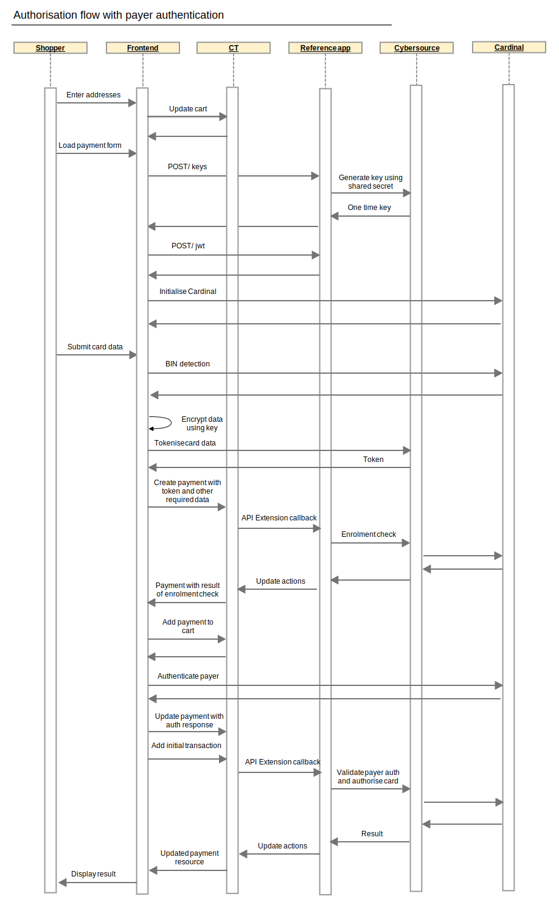

# Authorize a Payment (With Payer Authentication)

To authorize a payment with 3DS functionality, a payment should be created with the amount to authorise, a token representing the payment card and the billing address associated with the card.

A check will be made during payment creation to see if the card is enrolled in 3DS and if authentication is required. If authentication is required, the created payment will contain data required to continue the authentication process.

After authentication is complete, authorisation of the payment can then be triggered by adding an initial transaction to the payment.

  

## Details

1.  Prepare your cart
    
    1.  Ensure the cart locale is set
    
    2.  Ensure the cart billing and shipping addresses are set. The
        default mapping of commercetools address fields to Cybersource
        fields is as follows. If you require a different mapping this
        can be [customised](Customisation.md)
        
    | Commercetools address       | Cybersource shipping fields | Cybersource billing fields | Notes |
    | --------------------------- | --------------------------- | -------------------------- | ----- |
    | firstName                   | shipTo_firstName            | billTo_firstName           |       |
    | lastName                    | shipTo_lastName             | billTo_lastName            |       |
    | streetNumber and streetName | shipTo_street1              | billTo_street1             | If both values populated they are concatenated together with a space between. Otherwise streetName is used by itself |
    | city                        | shipTo_city                 | billTo_city                |       |
    | postalCode                  | shipTo_postalCode           | billTo_postalCode          |       |
    | region                      | shipTo_state                | billTo_state               |       |
    | country                     | shipTo_country              | billTo_country             |       |
    | email                       | Not used                    | billTo_email               |       |

2.  Retrieve a request JWT for Cardinal
    
    1.  Make a POST request to http://{host}:{port}/jwt. The response is
        a JSON Web Token to be sent to Cardinal

3.  Initialise Cardinal with the request JWT
    
	      Cardinal.setup("init", {
	        // cardinalRequestJwt is value retrieved in above step
	         jwt: cardinalRequestJwt
	      });

4.  Wait for Cardinal payments.setupComplete complete event. See [3D
    Secure Setup](3D-Secure-Setup.md) for details of the
    one-time setup for this

5.  Tokenise credit card details using Cybersource Flex (this step may
    be performed in advance and the token saved for later re-use)
    
    1.  Retrieve one time key
        
        Make a POST request to http://{host}:{port}/keys. The response will be JSON containing two properties - the captureContext and the verificationContext - both of which are JWTs
    
    2.  Use the Flex Microform 0.11 to tokenise card details See <https://github.com/CyberSource/cybersource-flex-samples-java/tree/master/jsp-microform> for an example of how to use the captureContext obtained above and the Flex Microform JS to tokenise a credit card.

    This step can be skipped when using a saved token

6.  Call [Cardinal BIN detection](https://cardinaldocs.atlassian.net/wiki/spaces/CC/pages/311984510/BIN+Detection)
    
	      Cardinal.trigger("bin.process", cardNumber).then(function(results){
	        // create commerce tools payment as per next step
	      });
    
    ⚠️ **There are other ways to call BIN detection as documented at <https://cardinaldocs.atlassian.net/wiki/spaces/CC/pages/311984510/BIN+Detection>**
    
    ⚠️ **cardNumber should be at least the first 6 digits of the card number but may be anything up to the full card number if available**

7.  Create a commercetools payment
    (<https://docs.commercetools.com/http-api-projects-payments>) and
    populate the following
    
    | Property                                  | Value                                      | Required  | Notes |
    | ----------------------------------------- | ------------------------------------------ | --------- | ----- |
    | customer                                  | Reference to commercetools customer        | See notes | Required for non-guest checkout. If using MyPayments API this will automatically be set to the logged in customer. One of customer or anonymousId must be populated |
    | anonymousId	                            | Id for tracking guest checkout             | See notes | Required for guest checkout. If using MyPayments API this will automatically be set to the session id of the anonymous oauth token. One of customer or anonymousId must be populated |
    | paymentMethodInfo.paymentInterface        | cybersource                                | Yes       |  |
    | paymentMethodInfo.method                  | creditCardWithPayerAuthentication          | Yes       | The reference application is set up to support payments with and without payer authentication and the method is used to determine which is being used.    Typically an implementation would choose one or the other and the method name may be different to this |
    | amountPlanned                             | Amount to authorise                        | Yes       | Should match cart gross total, unless split payments are being used |
    | custom.fields.cs_token                    | Cybersource flex token                     | See notes | This is the token parameter passed into the callback for the microform.createToken call     Required when not using a saved token |
    | custom.fields.cs_tokenVerificationContext | Token verification context                 | See notes | This is the verificationContext property from the call to the /keys service    Required when cs_token is populated |
    | custom.fields.cs_tokenAlias               | Alias for saved token                      | No        | When this is specified the token will be saved as a subscription for later use |
    | custom.fields.cs_savedToken               | Saved token value                          | No        | Required when paying with a saved token |
    | custom.fields.cs_maskedPan                | Masked credit card number                  | No        | Can be obtained from the token parameter passed into the callback for the microform.createToken call. The token is a JWT which when decoded has a data.number field containing the masked card number.    Not required by extension but can be used for display |
    | custom.fields.cs_cardType                 | Credit card type                           | No        | For display only |
    | custom.fields.cs_cardExpiryMonth          | Card expiry month                          | No        | For display only |
    | custom.fields.cs_cardExpiryYear           | Card expiry year                           | No        | For display only |
    | custom.fields.cs_acceptHeader             | Value of Accept header from user's browser | Yes       | Used by 3DS process, populated from client-side libraries |
    | custom.fields.cs_userAgentHeader          | Value of Accept header from user's browser | Yes       | Used by 3DS process, populated from client-side libraries |
    
    a.  Also see [Decision Manager](Decision-Manager.md) for additional fields to populate if you are using Decision Manager
    
    b.  When processing the payment creation the extension will do an enrolment check to see if the card is enrolled in 3D Secure

8.  Add the payment to the cart

9.  Check the value of the cs\_payerAuthenticationRequired field on the
    created payment. If the value is true, perform the following steps
    
    a.  Call Cardinal.continue with
        
	      Cardinal.continue('cca',
	        {
	          "AcsUrl": <value of cs_payerAuthenticationAcsUrl from created payment>,
	          "Payload": <value of cs_payerAuthenticationPaReq from created payment>
	        },
	        {
	          "OrderDetails": {
	            "TransactionId": <value of cs_payerAuthenticationTransactionId from created payment>
	          }
	        }
	      );
    
    b.  The payer authentication window will be displayed and when the user completes the process you will receive a payments.validated event. Inspect the response to determine if the validation was successful and extract the response JWT
    
    c.  Update the commerce tools payment to set the value of custom.fields.cs\_responseJwt to the value extracted from the Cardinal response

10. Add a transaction to the payment with the following values populated
    
    | Property | Value               | Notes                                 |
    | -------- | ------------------- | ------------------------------------- |
    | type     | Authorization       |                                       |
    | state    | Initial	         |                                       |
    | amount   | Amount to authorise | Should match amountPlanned on payment |

11. Verify the payment state
    
    a. If the authorisation was successful the transaction state will have been updated to **Success**
    b. See [Overview\#Errorhandling](Overview.md#Errorhandling) for handling errors or failures

12. Convey the payment result to the customer. If this is the only/final payment for this order you can transition your commercetools cart to an order at this point

## Stored values

The following values are stored within commerce tools to allow later
verification that the payer was authenticated correctly

  - Responses to the enrolment check are stored on a payment interface interaction with a type key of `cybersource_payer_authentication_enrolment_check`

  - Responses to the authentication validation are stored on a payment interface interaction with a type key of `cybersource_payer_authentication_validate_result`

  - The request and response Cardinal JWTs are stored a custom properties on the payment

  - The paReq and acsUrl values are stored a custom properties on the payment
    
    ⚠️ **V1 paReq values can be decoded by Base64 decoding the string and then inflating the resulting bytes**
    
    ⚠️ **V2 paReq values can be decoded by Base64 decoding the string**
    
When a token is saved as a subscription the saved token value will be returned as a custom property on the payment called cs_savedToken

See [Commercetools Setup](Commercetools-Setup.md) for more details on the individual fields.

## Further reading

* [Cybersource Payer Authentication documentation](http://apps.cybersource.com/library/documentation/dev_guides/Payer_Authentication_SO_API/Payer_Authentication_SO_API.pdf)
* [Cardinal Cruise Hybrid Integration documentation](https://cardinaldocs.atlassian.net/wiki/spaces/CC/pages/360668/Cardinal+Cruise+Hybrid)
