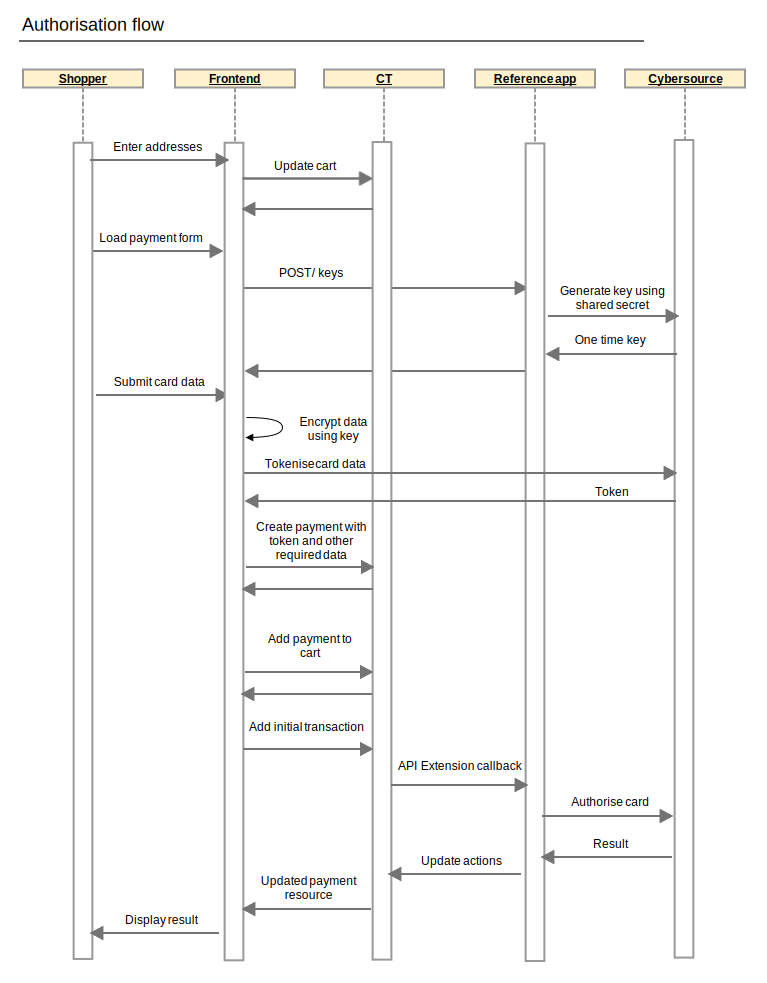

# Authorize a Payment (Without Payer Authentication)

Authorisation of a payment is triggered by adding an initial transaction to a commercetools payment resource. Before this can be done the payment must be populated with the amount to authorise, a token representing the payment card and the billing address associated with the card.

## Details

1.  Prepare your cart
    
    1.  Ensure your cart locale is set.
    
    2.  Ensure the cart billing and shipping addresses are set. The default mapping of commercetools address fields to Cybersource fields is as follows. If you require a different mapping this can be [customised](Customisation.md)
        
| Commercetools address                    | Cybersource shipping fields      | Cybersource billing fields     | Notes                                                 |
| ---------------------------------------- | -------------------------------- | ------------------------------ | ----------------------------------------------------- |
| firstName                                | shipTo_firstName                 | billTo_firstName               |                                                       |
| lastName                                 | shipTo_lastName                  | billTo_lastName                |                                                       |
| streetNumber and streetName              | shipTo_street1                   | billTo_street1                 | If both values populated they are concatenated together with a space between. Otherwise streetName is used by itself |
| city                                     | shipTo_city                      | billTo_city                    |                                                       |
| postalCode                               | shipTo_postalCode                | billTo_postalCode              |                                                       |
| region                                   | shipTo_state                     | billTo_state                   |                                                       |
| country                                  | shipTo_country                   | billTo_country                 |                                                       |
| email                                    | Not used                         | billTo_email                   |                                                       |

2.  Tokenise credit card details using Cybersource Flex
    
    1.  Retrieve the Flex capture context: Make a POST request to `http://{host}:{port}/keys`. The response will be JSON containing two properties - the captureContext and the verificationContext - both of which are JWTs
    
    2.  Use the Flex Microform 0.11 to tokenise card details See <https://github.com/CyberSource/cybersource-flex-samples-java/tree/master/jsp-microform> for an example of how to use the captureContext obtained above and the Flex Microform JS to tokenise a credit card.

    This step can be skipped when using a saved token

3.  Create a commercetools payment (<https://docs.commercetools.com/http-api-projects-payments>) and populate the following
    
| Property                                  | Value                                  | Required   | Notes                                                                         |
| ----------------------------------------- | -------------------------------------- | ---------- | ----------------------------------------------------------------------------- |
| customer                                  | Reference to commercetools customer    | See notes  | Required for non-guest checkout. If using MyPayments API this will automatically be set to the logged in customer. One of customer or anonymousId must be populated |
| anonymousId                               | Id for tracking guest checkout         | See notes  | Required for guest checkout. If using MyPayments API this will automatically be set. One of customer or anonymousId must be populated |
| paymentMethodInfo.paymentInterface        | isv_payments                           | Yes        | Required for guest checkout. If using MyPayments API this will automatically be set to the session id of the anonymous oauth token. One of customer or anonymousId must be populated |
| paymentMethodInfo.method                  | creditCard                             | Yes        | The reference application is set up to support payments with and without payer authentication and the method is used to determine which is being use    Typically an implementation would choose one or the other and the method name may be different to this                  |
| amountPlanned                             | Amount to authorise                    | Yes        | Should match cart gross total, unless split payments are being used           |
| custom.fields.isv_token                    | Cybersource flex token                 | See notes  | This is the token parameter passed into the callback for the microform.createToken call    Required when not using a saved token |
| custom.fields.isv_tokenVerificationContext | Token verification context             | See notes  | This is the verificationContext property from the call to the /keys service    Required when isv_token is populated |
| custom.fields.isv_tokenAlias               | Alias for saved token                  | No         | When this is specified the token will be saved as a subscription for later use |
| custom.fields.isv_savedToken               | Saved token value                      | No         | Required when paying with a saved token |
| custom.fields.isv_maskedPan                | Masked credit card number              | No         | Can be obtained from the token parameter passed into the callback for the microform.createToken call. The token is a JWT which when decoded has a data.number field containing the masked card number.    Not required by extension but can be used for display |
| custom.fields.isv_cardType                 | Credit card type                       | No         | For display only                                                              |
| custom.fields.isv_cardExpiryMonth          | Card expiry month                      | No         | For display only                                                              |
| custom.fields.isv_cardExpiryYear           | Card expiry year                       | No         | For display only                                                              |

Also see [Decision Manager](Decision-Manager.md) for additional fields to be populated if you are using Decision Manager

4.  Add the payment to the cart

5.  Add a transaction to the payment with the following values populated

| Property  | Value                 | Notes                                 |
| --------- | --------------------- | ------------------------------------- |
| type      | Authorization         |                                       |
| state     | Initial               |                                       |
| amount    | Amount to authorise   | Should match amountPlanned on payment |

6.  Verify the payment state
    
    a.  If the authorisation was successful the transaction state will have been updated to **Success**
    b.  See [Overview\#Errorhandling](Overview.md#Errorhandling) for handling errors or failures

7.  Convey the payment result to the customer. If this is the only/final payment for this order you can transition your commercetools cart to an order at this point

## Stored values
    
When a token is saved as a subscription the saved token value will be returned as a custom property on the payment called isv_savedToken

See [Commercetools Setup](Commercetools-Setup.md) for more details on the individual fields.