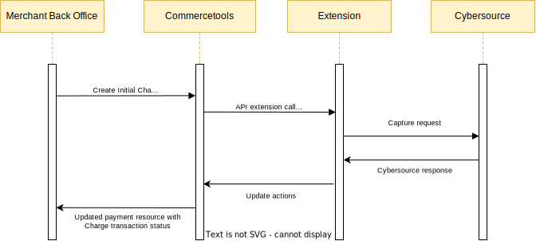

# Capture a Payment

## Capture Service Sequence Diagram

## Process

To capture a payment, an Authorization must have been completed. When the Payment Update API plugin receives a payment that contains an INITIAL CHARGE transaction, it will attempt to capture the requested amount on the transaction using the `interactionId` of the existing SUCCESS AUTHORIZATION transaction on the payment.

## Steps

To capture a payment:

- Complete an authorization, ensuring that the state is `Success`
- Update the payment, adding an INITIAL CHARGE transaction onto the payment with a value to be captured

Capture Response Handling

- A successful capture will change the INITIAL CHARGE to a SUCCESS CHARGE transaction, adding the Capture Request Id onto the transaction as an `interactionId`

- If the settlement is not successful, the plugin will change the INITIAL CHARGE to FAILURE CHARGE transaction, adding the Capture Request Id onto the transaction as an `interactionId`. One can request a capture again if it is failed
