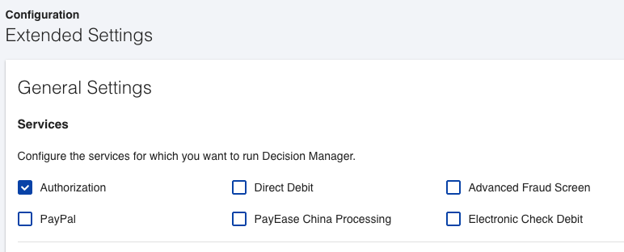
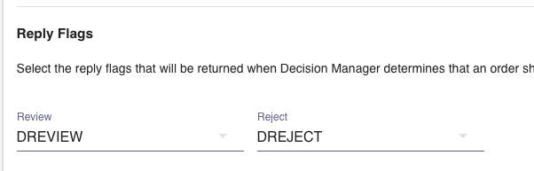
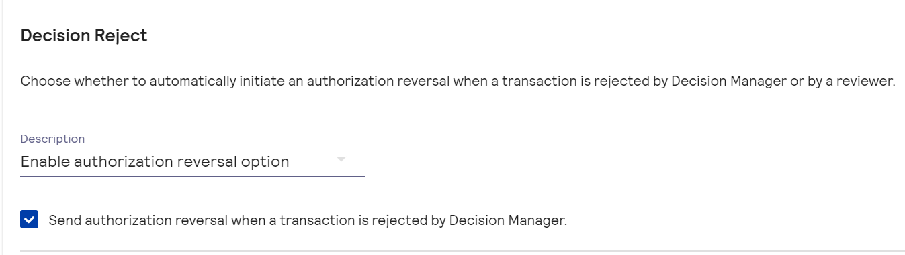
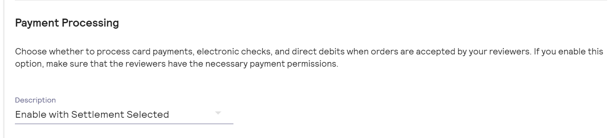
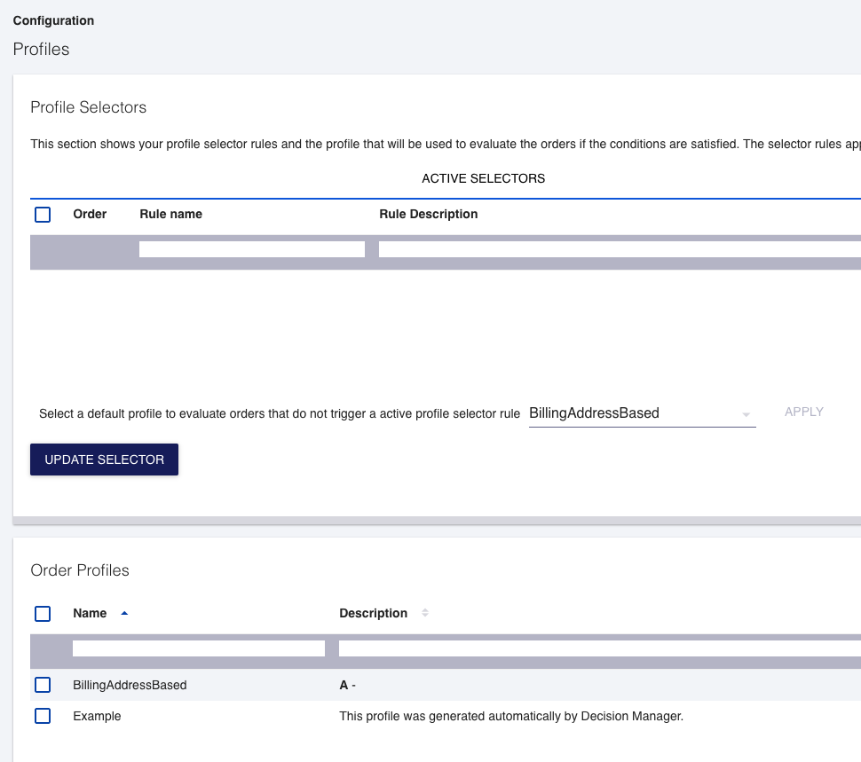
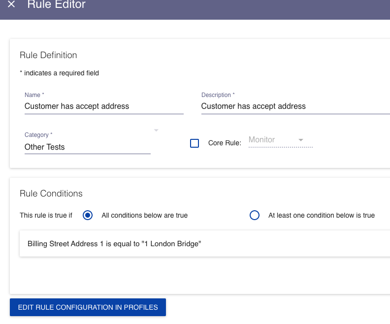

# Decision Manager

## Field mapping

Fields which are used by Decision Manager are mapped from Commercetools fields as follows

| Resource          | Field name   | Cybersource field | Notes |
| ----------------- | ------------ | ----------------- | ------|
| cart.shippingAddress        | firstName | shipTo_firstName     | |
| cart.shippingAddress | lastName | shipTo_lastName    | |
| cart.shippingAddress | streetNumber and streetName | shipTo_address1    | If both fields have values they are concatenated with a space. Otherwise the value of the defined field is used|
| cart.shippingAddress | city | shipTo_city    | |
| cart.shippingAddress | postalCode | shipTo_postalCode    | |
| cart.shippingAddress | region | shipTo_state    | |
| cart.shippingAddress | country | shipTo_country    | 2 letter ISO code |
| cart.lineItem[#] | quantity | item_#_quantity    | Each line item in the cart is mapped |
| cart.lineItem[#] | totalPrice | item_#_unitPrice    |  |
| cart.lineItem[#] | name | item_#_productName    | Name is a localise string property. We use the cart locale to decide which value to extract |
| cart.lineItem[#] | variant.sku | item_#_productSKU    |  |
| payment | isv_deviceFingerprintId | deviceInformation_fingerprintSessionId    |  |

### Device Fingerprinting

Follow the appropriate Cybersource guide for device fingerprinting and add the session Id used for this to the Commercetools payment as a custom field called `isv_deviceFingerprintId`. 

You can use any unique string such as an order number or web session Id or Commercetools payment Id. The string can be combination of uppercase and lowercase letters, digits, and these special characters: hyphen (-) and underscore (_). However, do not use the same uppercase and lowercase letters to indicate different session Ids. 

Replace sessionId with the unique Id generated in the URL "https://h.online-metrix.net/fp/tags.js?org_id={{org Id}}&session_id={{merchant Id}}{{session Id}}" and include the script wherever you want deviceFingerprint Id to be captured.

Replace the below data:
- {{org Id}} - To obtain this value, contact the Cybersource representative and specify to them whether it is for testing or production. 
- {{merchant Id}} - Unique Cybersource merchant Id. 
- {{session Id}} - Value of unique Id generated above

> **_NOTE:_** Extension will send value present in the field `isv_deviceFingerprintId` to Cybersource, only if `PAYMENT_GATEWAY_DECISION_MANAGER` is enabled from the .env file. 

### Enabling/disabling Decision Manager for specific payments

The Cybersource Extension has environment variable for decision manager as `PAYMENT_GATEWAY_DECISION_MANAGER`, you can set the values to true or false to enable or disable decision manager. If set to true, `PAYMENT_GATEWAY_DECISION_SYNC_MULTI_MID` variable must be configured with comma separated values of different merchant Ids in which decision manager has to be executed.

> **_NOTE:_** Value for `PAYMENT_GATEWAY_DECISION_SYNC_MULTI_MID` is case sensitive without any spaces.

## Optional fields

To pass additional data to Decision Manager, it is possible to customize the Commercetools resources to add extra fields. If these fields exist and there are values present for these, then the extension will pass the values on to Cybersource in the appropriate request

| Resource          | Field name   | Cybersource field | 
| ----------------- | ------------ | ----------------- |
| payment        | isv_customerIpAddress | deviceInformation_ipAddress |

### Sample definitions

#### Payment

The following is an example of field definitions for the customer IP address. They would need to be added to the base field definitions and any other payment customizations you may already have

    {
      "fieldDefinitions": [
        {
          "type": {
            "name": "String"
          },
          "name": "isv_customerIpAddress",
          "label": {
            "en": "Customer IP address"
          },
          "required": false
        }
      ],
      "key": "isv_payment_data",
      "name": {
        "en": "ISV payment service custom payment fields"
      },
      "resourceTypeIds": [
        "payment"
      ]
    }

## Test settings

To support testing Decision Manager responses, it is necessary to configure Decision Manager in Business Centre. This allows triggering of particular responses by matching line 1 of the billing address

- In Decision Manager → Configuration → Extended Settings, enable
  Decision Manager for Authorization
  - Also ensure the reply flags are set to DREVIEW and DREJECT
  - If you need Business Centre to trigger Authorization Reversal automatically during Reject After Auth cases, make sure that you select the checkbox under Decision Manager → Configuration → Extended Settings to enable it. Otherwise, extension will automatically trigger Authorization Reversal
  - When Sale transaction is in review state, before reviewing it navigate to Decision Manager → Configuration → Extended Settings and make sure to select the "Enable Settlement With Selected" for payment processing. Make sure the amount entered for settlement is same to the amount authorized in this case.

- In Decision Manager → Configuration → Profiles create a new profile
  and set it as default
  - Disable the Threshold Rule Generator
  - Add an Accept rule with the condition 'Billing Street Address 1 is equal to "1 London Bridge"'
  - Add a Review rule with the condition 'Billing Street Address 1 is equal to "2 London Bridge"'
  - Add a Reject rule with the condition 'Billing Street Address 1 is equal to "3 London Bridge"'

See also the following
screenshots

### Extended Settings

### Profiles

### Profile

### Rule example

