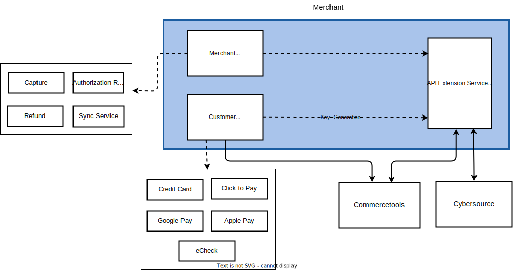

# Overview

- [Architecture](#architecture)
- [Endpoints](#endpoints)
- [Validation](#validation)
- [Error handling](#error-handling)
  - [Communications failure on Payment Create](#communications-failure-on-payment-create)
  - [Cybersource request failures](#cybersource-request-failures)
  - [API Extension errors](#api-extension-errors)

The Cybersource-Commercetools extension is an implementation of the Cybersource Services in typescript, using the cybersource-rest-client node package manager. The extension allows processing of payments registered in Commercetools through the Cybersource payment gateway. It is realized by the usage of a typescript application configured as a Payment Create, Payment Update API and Customer Update API extensions for a Commercetools project and interacts with Cybersource to carry out various actions depending on the payment state, making further updates to the Commercetools payment as appropriate when Cybersource has processed the request.

It is intended that when using the extension the developer would consider how the application should be secured, ran and scaled before it is exposed to the outside world. The extension provides a reference for functional integration only.

# Architecture

The architecture of the implementation looks as follows - the dotted lines show optional features of the implementation:

# EndPoints

The Commercetools Cybersource extension exposes the following endpoints

| URL          | Method   | Input | Output | Description |
| ------------ | -------- | ----- | ------ | ----------- |
| http://{host}:{port}/api/extension/payment/create | POST | Message containing payment | Create payment | Receives and processes payment create messages. This endpoint should be defined in Commercetools as the Payment Create API Extension |
| http://{host}:{port}/api/extension/payment/update | POST | Message containing payment | Updates to be made to payment |  Receives and processes payment update messages. This endpoint should be defined in Commercetools as the Payment Update API Extension |
| http://{host}:{port}/api/extension/customer/update | POST | Message containing customer token | Updates to be made to customer token | Receives and processes customer update messages. This endpoint should be defined in Commercetools as the Customer Update API Extension |

## Requirements and Design Decisions

The extension assumes full control of the management of Payment resources. Due to this, there should be no manual modifications to payments and also <b>no other payments API Extensions that affect payments should be running in parallel</b>.

For this integration, Payment is a representation of single charge to a customer. Due to this, you can not authorize a payment multiple times. If you are attempting to use split payments for an order, you need to create multiple payments for the order.

# Validation

If required data is missing or the operation is invalid(such as trying to capture a payment without authorizing the payment beforehand), when you try to create or update a payment you will receive a response containing an array of one or more errors as per the [Commercetools documentation](https://docs.commercetools.com/api/projects/api-extensions#error-cases).

While Commercetools handles some validations(in terms of required fields), the extension implements further validations to ensure that payments are in the correct state before proceeding. These validations vary per action and can be found in more detail on the relevant Checkout Steps pages.

# Error handling

When an attempt at processing a payment there can be varying responses depending on the reason for failure.

## Communications failure on Payment Create

If on a payment create, the API extension cannot communicate with Cybersource, the API Extension will return `InvalidOperation` error.

## Cybersource request failures

When Cybersource returns an unsuccessful response code, the relevant transaction's state will be updated to **Failure** and the transaction will be updated to contain an interactionId containing the request Id of the Cybersource request. This can be used to search for the transaction in Cybersource Merchant Center to diagnose the issue.

## API Extension errors

When there is an error in the API Extension itself, the payment will be updated to contain a new interfaceInteraction of type `isv_payment_failure`, containing a message from the exception that was thrown.
