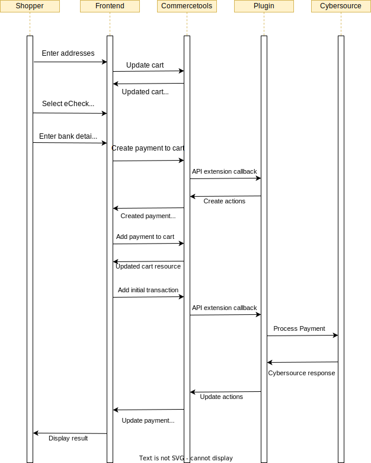

# Process a Payment (eCheck)

## eCheck Processing Sequence Diagram

Make sure the checkout page is setup to collect all the required information from customer as mentioned in [eCheck Setup](./eCheck-Setup.md)
## Details

1.  Create / prepare your cart

    a. Ensure your cart locale is set
    
    b. Ensure the cart billing and shipping addresses are set. Phone number is a mandatory field in address for eCheck transaction 

    > **_NOTE:_** : If the cart has multiple shipping methods, the shipping address of the first available shipping method applied to the cart will be used to process the payment
    

2. Enter the account number, account type and routing number

3.  Create a Commercetools payment
    (https://docs.commercetools.com/api/projects/payments) and
    populate the following

    | Property                              | Value                               | Required  | Notes                                                                                                                                                                                                                                                                                                                                                                                                                                                                                                                                                                                                                                                                                                         |
    | ------------------------------------- | ----------------------------------- | --------- | ------------------------------------------------------------------------------------------------------------------------------------------------------------------------------------------------------------------------------------------------------------------------------------------------------------------------------------------------------------------------------------------------------------------------------------------------------------------------------------------------------------------------------------------------------------------------------------------------------------------------------------------------------------------------------------------------------------- |
    | customer                              | Reference to Commercetools customer | See notes | Required for non-guest checkout. If using MyPayments API this will automatically be set to the logged in customer. One of customer or anonymousId must be populated                                                                                                                                                                                                                                                                                                                                                                                                                                                                                                                                           |
    | anonymousId                           | Id for tracking guest checkout      | See notes | Required for guest checkout. If using MyPayments API this will automatically be set. One of customer or anonymousId must be populated                                                                                                                                                                                                                                                                                                                                                                                                                                                                                                                                                                         |
    | paymentMethodInfo.paymentInterface    | Cybersource                         | Yes       |                                                                                                                                                                                                                                                                                                                                                                                                                                                                                                                                                                                                                                                                                                               |
    | paymentMethodInfo.method              | eCheck                              | Yes       |                                                                                                                                                                                                                                                                                                                                                                                                                                                                                                                                                                                                                                                                                                               |
    | custom.type.key                       | isv_payment_data                    | Yes       |                                                                                                                                                                                                                                                                                                                                                                                                                                                                                                                                                                                                                                                                                                               |
    | custom.fields.isv_accountNumber       | Customer account number             | Yes       | Encoded account number for customer's bank account (Max length is 17)                                                                                                                                                                                                                                                                                                                                                                                                                                                                                                                                                                                                                                                            |
    | custom.fields.isv_accountType         | Customer account type               | Yes       | Possible customer account type (Possible values are mentioned in [eCheck Setup](./eCheck-Setup.md))                                                                                                                                                                                                                                                                                                                                                                                                                                                                                                                                                                                                                                                                                |
    | custom.fields.isv_routingNumber       | Customer routing number             | Yes       | Also named as transit number(Max 9 digits)                                                                                                                                                                                                                                                                                                                                                                                                                                                                                                                                                                                                                                                |
    | amountPlanned                         | Amount to be processed              | Yes       | Should match cart gross total, unless split payments are being used                                                                                                                                                                                                                                                                                                                                                                                                                                                                                                                                                                                                                                           |
    | custom.fields.isv_deviceFingerprintId | Customer device fingerprint id      | Yes       | Refer [Device Fingerprinting](./Decision-Manager.md#device-fingerprinting) to generate this value|
    | custom.fields.isv_customerIpAddress   | Customer IP address                 | Yes       | Populated from client-side libraries                                                                                                                                                                                                                                                                                                                                                                                                                                                                                                                                                                                                                                                                          |
    | custom.fields.isv_merchantId   | Merchant Id used for the transaction                 | No       | Required when you want to support Multi-Mid functionality. Populate this field with the value of merchant Id in which the transaction should happen. When this field is empty, default mid configuration will be considered for the transaction. The same mid will be used for the follow-on transactions.                                                                                         |
    | custom.fields.isv_shippingMethod | Shipping method for the order                                                                                         | No    | Possible values: <ul> <li> `lowcost`: Lowest-cost service  </li> <li>`sameday`: Courier or same-day service </li> <li>`oneday`: Next-day or overnight service </li> <li>`twoday`: Two-day service </li> <li>`threeday`: Three-day service.</li> <li> `pickup`: Store pick-up </li> <li> `other`: Other shipping method </li> <li> `none`: No shipping method because product is a service or subscription </li>  |
    | custom.fields.isv_metadata | Metadata for the order                                                                                         | No    | This field can be used to send additional custom data as part of the authorization request. The data should be serialized into a string format (e.g., JSON string) before passing it in the request. **Example:**"isv_metadata": "{\"1\":\"value1\", \"2\":\"value2\"}"   |

4.  Add the payment to the cart

5.  Add a transaction to the payment

    | Property | Value                  | Notes                                 |
    | -------- | ---------------------- | ------------------------------------- |
    | type     | Charge                 |                                       |
    | state    | Initial                |                                       |
    | amount   | Amount to be processed | Should match amountPlanned on payment |

6.  Verify the payment state and convey the payment result to the customer

    a. If the transaction is successful, transaction state will be updated to **Success**, display the order confirmation page

    b. If the state of transaction is updated to **Pending** which is due to Fraud Check, display the order confirmation page

    c. If the state of transaction is updated to **Failure**, display the error page and See [Overview\#Errorhandling](Overview.md#error-handling) for handling errors or failures
