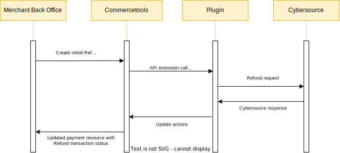

# Refund a Payment

## Refund Service Sequence Diagram

## Process

To refund a payment, a Capture must have been completed. When the Payment Update API Extension receives a payment that contains an INITIAL REFUND transaction, it will attempt to refund the requested amount on the transaction using the `interactionId` of the existing SUCCESS CHARGE transaction on the payment. You can perform multiple refunds but the total of all previous successful refunds and the current refund must be no more than the amount captured.

## Steps

To refund a payment:

- If Sale flag not enabled, complete an authorization and capture, ensuring that the state for both is `Success`
- If Sale flag enabled, complete a sale transaction, ensuring that the state for CHARGE is `Success`
- Update the payment, adding an INITIAL REFUND transaction onto the payment with an amount to be refunded

Refund Response Handling

- A successful refund will change the INITIAL REFUND to a SUCCESS REFUND transaction, adding the Credit Request Id onto the transaction as an `interactionId`

- If the refund is not successful due to any reason, the plugin will change the INITIAL REFUND to FAILURE REFUND transaction, adding the Refund Request Id onto the transaction as an `interactionId`. One can request a refund again if it is failed
