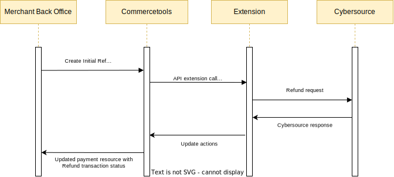

# Refund a Payment

## Refund Service Sequence Diagram

## Process

To refund a payment, Capture must have been completed. When the Payment Update API Extension receives a payment that contains an INITIAL REFUND transaction, it will attempt to refund the requested amount on the transaction using the `interactionId` of the existing SUCCESS CHARGE transaction on the payment. You can perform multiple refunds but the total of all previous successful refunds and the current refund must be not more than the amount captured.

## Steps

To refund a payment:

- If Sale flag is not enabled, complete an authorization and capture, ensuring that the state for both is `Success`
- If Sale flag is enabled, complete a sale transaction, ensuring that the state for CHARGE is `Success`
- Update the payment, adding an INITIAL REFUND transaction onto the payment with an amount to be refunded
- If there is more than one capture with state as `Success`,
  - The amount of any capture transaction matches with the requested refund amount, then the Id of that particular capture transaction is used to perform refund
  - If there is more than one capture transaction available with same amount as requested refund amount, then the Id of very first capture transaction is used to perform refund
  - If none of the capture transaction's amount matches with the requested refund amount, then multiple refunds will be triggered using different capture transactions added
   

Refund Response Handling

- A successful refund will change the INITIAL REFUND to a SUCCESS REFUND transaction, adding the Credit Request Id onto the transaction as an `interactionId` when any capture transaction amount is equal to requested refund amount

- A successful refund will add new SUCCESS REFUND transaction, adding the Credit Request Id onto the transaction as an `interactionId` and the requested amount will be mapped as the `amount` when any capture transaction amount do not match with the refund amount

- If the refund is not successful due to any reason, the extension will change the INITIAL REFUND to FAILURE REFUND transaction, adding the Refund Request Id onto the transaction as an `interactionId`. One can request a refund again if it is failed
