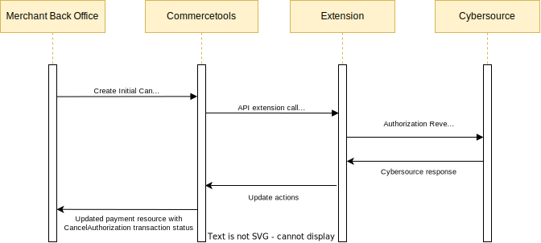

# Reverse a Payment

## Authorization Reversal Service Sequence Diagram

## Process

To reverse a payment, an Authorization must have been completed. When the Payment Update API Extension receives a payment that contains an INITIAL CANCEL_AUTHORIZATION transaction, it will attempt to reverse the requested amount on the transaction using the `interactionId` of the existing SUCCESS AUTHORIZATION transaction on the payment. The requested amount must be equal to the amount original authorized.

## Steps

To reverse a payment:

- Complete an authorization, ensuring that the state is `Success`
- Update the payment, adding an INITIAL CANCEL_AUTHORIZATION transaction onto the payment with an amount matching the amount of authorization being reversed

Cancel Authorization Response Handling

- A successful reversal will change the INITIAL CANCEL_AUTHORIZATION to a SUCCESS CANCEL_AUTHORIZATION transaction, adding the Reversal Request Id onto the transaction as an `interactionId`

- If the reversal is not successful due to any reason, the extension will change the INITIAL CANCEL_AUTHORIZATION to FAILURE CANCEL_AUTHORIZATION transaction along with adding the Reverse Request Id onto the transaction as an `interactionId`. One can request a cancel authorization again if it is failed
