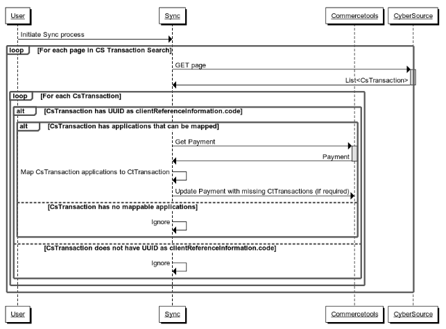

# Synchronising Payments

## Overview

Synchronising payments uses the [Cybersource Transaction Search API](https://developer.cybersource.com/api-reference-assets/index.md#transaction_search) and the [Conversion Detail API](https://developer.cybersource.com/api-reference-assets/index.md#reporting_conversion-details_get-conversion-detail-transactions) to search for transactions that contain a possible Commercetools Payment ID, and then compares the transaction against the Commercetools payment (if one is found), creating or updating transactions on the Commercetools payment if required.

This process is required for a few reasons:

  - To update the state of a payment that is in 'Pending' state due to Decision Manager flagging a payment for review. Once a payment in Review state has been approved or rejected, the transaction in Commercetools will move from Pending to Success or Failure the next time the payment is processed by the synchronization service.
  - To ensure eventual consistency in Commercetools in the scenario where a payment has been processed by Cybersource but there was an issue saving the reference to the payment in Commercetools (such as a network failure or an exception in the payments service).

## Implementation

An example of synchronising payments has been provided in the `sync-impl` project, and uses the `cs-ct-sync` module from the `library` project. This project is a Spring Boot command-line application. This means that the JAR file that the project will build will run a single operation and exit. The `sync-impl` project is configured to synchronize every payment found for the current day, 50 payments at a time.

TODO

## Process

### Updating Pending Transactions

#### Sequence Diagram 

TODO  

### Synchronizing Missing Transactions

#### Sequence Diagram (Synchronizing Missing Transaction)

  

#### Before and After Examples States

##### CT Payment
	{
	  "id": "123",
	  ...
	  "transactions": []
	}

##### CS Transaction
	{
	  "searchId":"xyz",
	  "_embedded": {
	    "transactionSummaries":[
	      {
	        "id": "5707854284416758104010",
	        "applicationInformation": {
	          "applications": [
	            {
	              "name": "ics_auth",
	              "reasonCode": "100",
	              "rMessage": "Request was processed successfully.",
	            },
	            {
	              "name": "ics_bill",
	              "reasonCode": "100",
	              "rMessage": "Request was processed successfully.",
	            }
	          ]
	        },
	        "clientReferenceInformation": {
	          "code": "123",
	          "applicationName": "Simple Order API"
	        }
	      }
	    ]
	  }
	}

##### CT Payment After Synchronisation
	{
	  "id": "123",
	  ...
	  "transactions": [
	    {
	      "state": "Success",
	      "type": "Authorization",
	      "interactionId": "5707854284416758104010"
	    },
	    {
	      "state": "Success",
	      "type": "Capture",
	      "interactionId": "5707854284416758104010"
	    }
	  ]
	}
