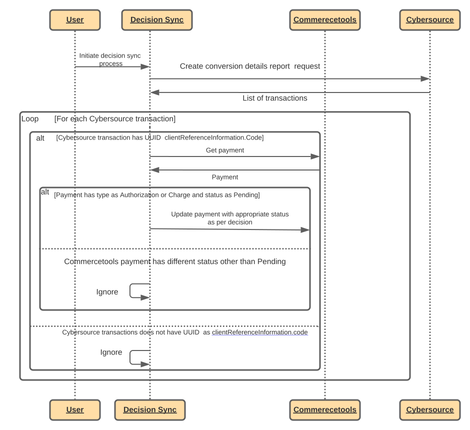
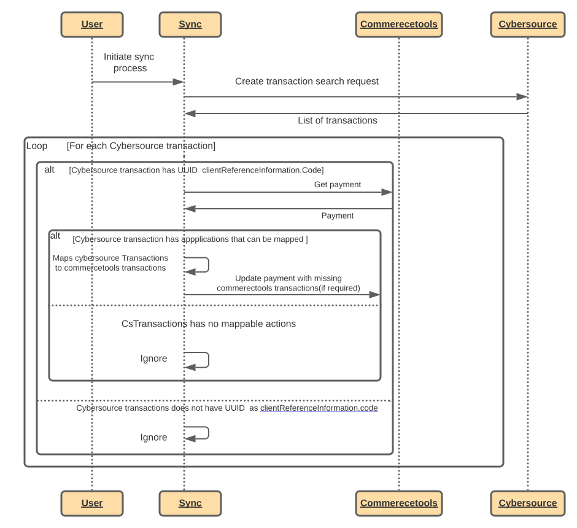

# Synchronizing Payments

## Overview

Synchronizing payments uses the [Cybersource Transaction Search API](https://developer.cybersource.com/api/developer-guides/dita-txn-search-details-rest-api-dev-guide-102718/txn-search-intro.html) and the [Conversion Detail API](https://developer.cybersource.com/api/developer-guides/dita-reporting-rest-api-dev-guide-102718/reporting_api/reporting-ondemand-detail-download.html) to search for transactions that contain a possible Commercetools Payment ID, and then compares the transaction against the Commercetools payment (if one is found), creating or updating transactions on the Commercetools payment if required.

This process is required for a few reasons:

- To update the state of a payment that is in 'Pending' state due to Decision Manager flagging a payment for review. Once a payment in Review state has been approved or rejected, the transaction in Commercetools will move from Pending to Success or Failure the next time the payment is processed by the synchronization service.
- To ensure eventual consistency in Commercetools in the scenario where a payment has been processed by Cybersource but there was an issue saving the reference to the payment in Commercetools (such as a network failure or an exception in the payments service).

## Implementation

For using Synchronizing services, they might be enabled from the configuration file. See the [API Extension Setup](API-Extension-Setup.md) for more details.

> **_NOTE:_** These fields are case sensitive

The `run sync` button in plugin UI (<https://{domain_where_plugin_is_hosted}/orders>) will synchronize every payment found for the current day, 50 payments at a time. Where as the `decision sync` also works in the similar way such that, it will update the state of payment that is in 'Pending' to either 'Success' or 'Failure' based on the Decision taken by the merchant.

Alternatively, Cron job can be used to run the sync periodically. Below are the endpoints for synchronization:

| Sync service  | Endpoint               | Note                                                                                            |
| ------------- | ---------------------- | ----------------------------------------------------------------------------------------------- |
| Decision sync | {baseUrl}/decisionSync | The baseUrl will be defined by where you deploy the plugin. HTTPS should be used for production |
| Run sync      | {baseUrl}/sync         | The baseUrl will be defined by where you deploy the plugin. HTTPS should be used for production |

## Process

### Updating Pending Transactions

#### Sequence Diagram  (Synchronizing Decisions)

### Synchronizing Missing Transactions

#### Sequence Diagram (Synchronizing Missing Transaction)

#### Before and After Examples States

##### CT Payment

    {
      "id": "123",
      ...
      "transactions": []
    }

##### CS Transaction

    {
      "searchId":"xyz",
      "_embedded": {
        "transactionSummaries":[
          {
            "id": "6445658584406673603955",
            "applicationInformation": {
              "applications": [
                {
                  "name": "ics_auth",
                  "reasonCode": "100",
                  "rMessage": "Request was processed successfully.",
                }
              ]
            },
            "clientReferenceInformation": {
              "code": "5051668f-a147-4afb-8b69-6309e460de9a",
              "applicationName": "REST API"
            }
          }
        ]
      }
    }

##### CT Payment After Synchronization

    {
      "id": "5051668f-a147-4afb-8b69-6309e460de9a",
      ...
      "transactions": [
        {
          "state": "Success",
          "type": "Authorization",
          "interactionId": "6445658584406673603955"
        }
      ]
    }
